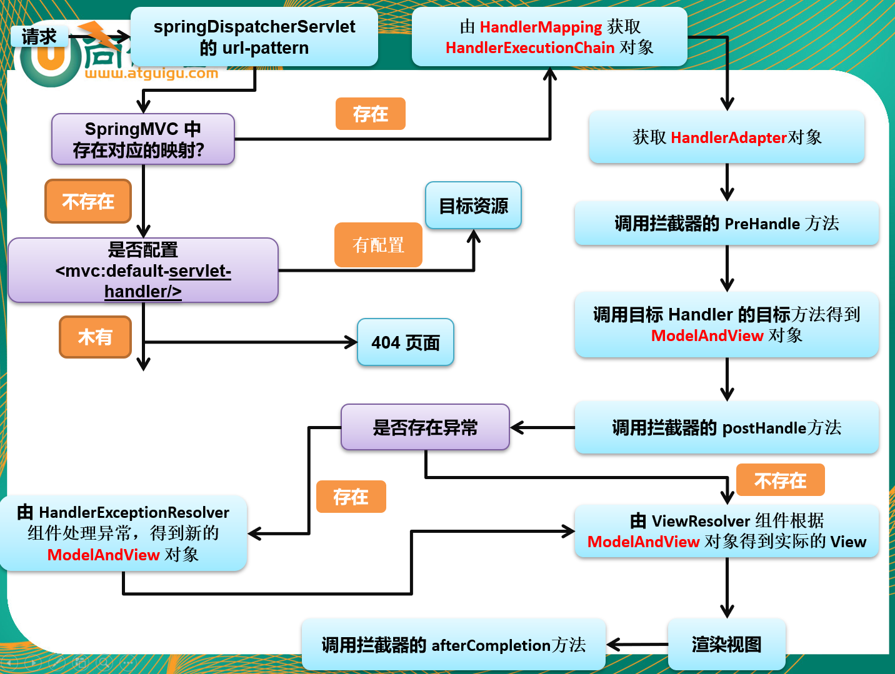

# SpringMVC 运行流程

1. 发出的所有请求，前端控制器（DispatchServlet）收到请求，调用doDispatch进行处理；

2. 根据 HandlerMapping 中保存的请求映射信息找到，处理当前请求的处理器执行链（包含拦截器）；

3. 根据当前处理器找到他的 HandlerAdapter（适配器）；

4. 拦截器的 preHandle 先执行；

5. 适配器执行目标方法，并返回ModelAndView；

   ...

6. 拦截器的 postHandle 执行；

7. 处理结果，页面渲染流程：

   1. 如果有异常使用异常解析器处理异常,处理完成后还会返回 ModelAndView;
   2. 调用 render 进行页面渲染：
      1. 视图解析器根据视图名得到视图对象；
      2. 视图对象调用 render 方法。

   3. 执行拦截器的 afterCompletion。

